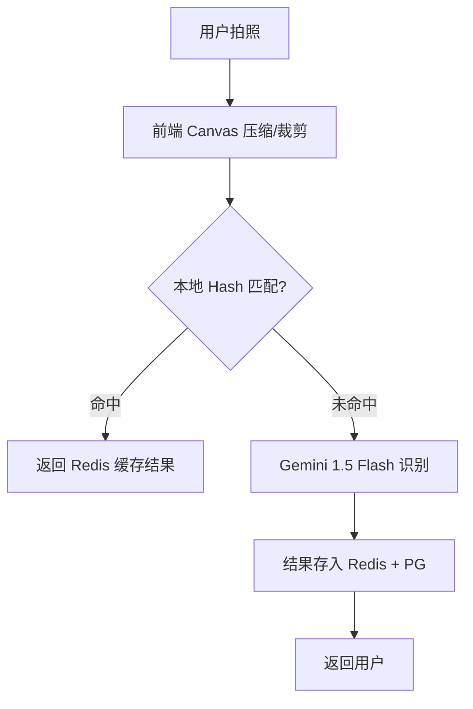

# AI Smart Diet Lens 企业级架构决策文档 (MVP 优化版)

> **版本**: 1.1.0 (MVP 增强版)
> **更新日期**: 2026-02-06
> **核心目标**: 高性价比、全球加速、极致体验、零漏洞感

---

## 一、 全球化数据与存储方案 (性价比与速度平衡)

### 1.1 存储与 CDN 架构 (针对中国及国际访问)

为了确保中国用户和国际用户都能快速访问，我们放弃单一云厂商方案，采用 **多云边缘加速策略**。

| 组件 | 选型 | 理由 | 成本 |
|------|------|------|------|
| **图片存储** | **Cloudflare R2** | 兼容 S3，**零流量出站费**，全球分布式存储 | $0 (10GB内免费) |
| **全球加速** | **Cloudflare CDN** | 中国区通过边缘节点优化，国际区秒开；自带基础 WAF 防护 | 免费层级 |
| **核心数据库** | **Supabase (PostgreSQL)** | 托管式 PG，自带实时 API 和 Auth，支持地理位置索引 | 免费层级 |
| **国内加速 (可选)** | **阿里云 OSS + CDN** | 若中国区访问延迟仍不理想，可作为 Phase 2 的国内镜像源 | 按量计费 |

### 1.2 图片优化策略 (提升“高大上”感)

*   **格式转换**: 统一在边缘侧转换为 **WebP/AVIF**。
*   **渐进式加载**: 采用 `BlurHash` 或 `LQIP` (低质量图片预览) 技术。在图片未加载完成时，显示模糊的色彩块而非空白，极大提升视觉高级感。
*   **骨架屏 (Skeleton)**: 列表页强制使用骨架屏占位，消除页面闪烁。

---

## 二、 AI 识别与成本控制 (极致性价比)

### 2.1 分层识别架构

为了防止 AI Token 损耗过快，引入前端预处理和多级缓存。

### 2.2 成本优化细节

| 优化点 | 方案 | 效果 |
|--------|------|------|
| **模型选型** | **Gemini 1.5 Flash** | 速度极快，价格仅为 Pro 的 1/10，适合 MVP 识别 |
| **图片预处理** | 前端裁剪至 512x512 | 减少上传带宽，降低 Vision 模型 Token 消耗 |
| **预生成百科** | 对 Top 500 热门食材进行 AI 预生成 | 90% 的用户查询不消耗实时 AI 成本 |
| **Unsplash 集成** | 百科配图优先调用 Unsplash API | 节省自建图库的存储和版权成本 |

---

## 三、 提升产品“无漏洞感”的鲁棒性设计

### 3.1 安全合规与防护

*   **API 签名校验**: 针对图片上传和 AI 识别接口，引入 **时间戳 + 随机字符串 + 密钥签名**，防止接口被恶意刷取 Token。
*   **Rate Limiting**: 在 Cloudflare 边缘侧配置频率限制（如：每分钟最多识别 5 次）。
*   **敏感词过滤**: 对 AI 生成内容进行基础的关键词过滤，确保合规。

### 3.2 性能与稳定性

*   **离线队列**: 识别请求失败时，自动保存至本地 `LocalStorage`，网络恢复后提示用户重试。
*   **Sentry 监控**: 接入 Sentry 免费层级，实时捕获前端崩溃和 API 异常，确保“零漏洞”口碑。
*   **优雅降级**: 若 AI 服务宕机，自动切换至“手动搜索”模式，并给予用户友好的提示。

---

## 四、 实施路线图 (Phase 1 MVP)

### 4.1 核心技术栈
*   **前端**: Uniapp (Vue3 + TS) + UnoCSS
*   **后端**: Cloudflare Workers (Serverless，极低成本) 或 Node.js (Docker)
*   **数据库**: Supabase (PostgreSQL)
*   **监控**: Sentry + Umami (轻量级统计)

### 4.2 预估月度成本 (MAU < 1万)
*   **计算/托管**: $0 (Cloudflare Workers 免费额度)
*   **数据库**: $0 (Supabase 免费层级)
*   **存储/CDN**: $0 (Cloudflare R2 免费额度)
*   **AI Token**: ~$5 - $10 (Gemini 1.5 Flash)
*   **总计**: **<$10 / 月** (实现企业级体验)

---

## 五、 待决策事项 (优化建议)

1.  **域名选择**: 建议购买 `.com` 或 `.io` 域名，并托管在 Cloudflare，这是实现全球加速的前提。
2.  **微信登录**: 国内 MVP 建议优先集成微信小程序登录，国际版集成 Google Auth (Supabase 自带)。
3.  **字体优化**: 使用系统默认字体族，避免加载巨大的中文字体包，确保首屏秒开。
